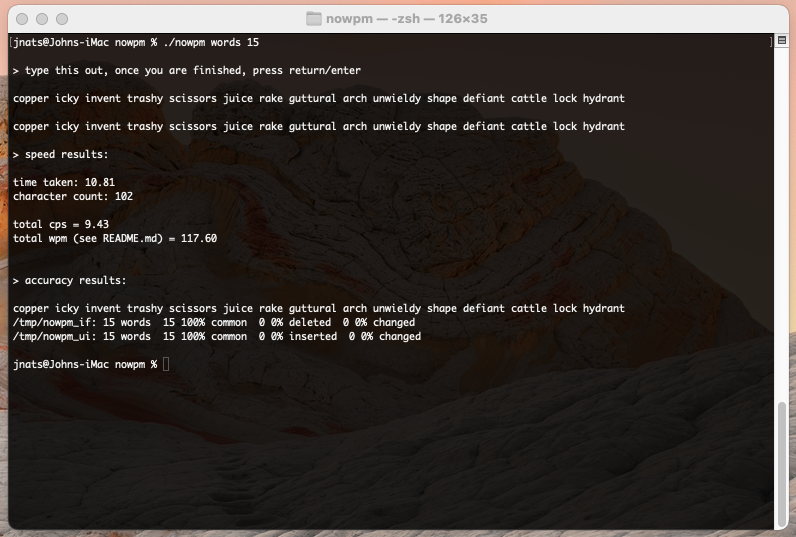

# nowpm

the no-bullshit wpm utility

you know the gist by now. you want to know how fast you can really type, but you're either on a slow connection, don't have a timer and calculator on hand, or think that all those typing speed websites are just tacky.

we've all been there

we all know how it feels

introduring `nowpm`, the wpm utility that just *does it's job*.

all you have to do is run `nowpm /path/to/file x`

x being the amount of words you want to grab from the file

the words are taken at random, and all lowercased (we're testing typing speed, not how fast and how often you can edge over to shift)

# install instructions

- clone the repo to your system

  `git clone https://github.com/jnats/nowpm`

- make sure install.sh is set as executable

  `chmod +x install.sh`

- run install.sh

  `./install.sh`

# dependencies

nothing big for this one, most of these you should find on any unix-based/like os.

make sure you have these: 

- either does or sudo (for install.sh (or just run `install.sh` as root))

- bash
- wdiff
- sed
- sort
- head
- tr
- python
- bc
- cp
- a readable and writable /tmp

#### addendum 1 : wpm

wpm is calculated by taking your cps (characters per second) and dividing it by the average amount of characters in a word.

the amount of characters in a word is calculated by taking the average of two values

- the average length of a "function" word (3.13)

- the average lenth of a "content" word (6.47)

  

this means the wpm is calculated based purely on averages, and as such may not be 100% accurate

both of these values were taken from page 382 of [this](https://pdf.sciencedirectassets.com/273276/1-s2.0-S0019995800X01489/1-s2.0-S0019995858902298/main.pdf) scientific paper

#### addendum 2 : time taken

the time taken is calculated by

- parsing a miniature pythons script to grab the current time in ms *right as* the typing prompt appears
- parsing said script again after you hit return/enter
- calculating the difference between these
- dividing by 1000 to get the time in seconds

i chose to call python instead of ` date -u %N` for one simple reason

*i do not primarily use linux.*

the %N feature is *not* available on \*bsd systems *or* macos (which also uses freebsd coreutils)

and since i write these programs to be able to work for *anyone*, i have made the active choice to run the python code instead. in my belief, it is reasonable to have python installed, but you shouldnt have to replace your own coreutils with GNU ones just to check the milliseconds, especially since more people now than ever are trying alternative options.
